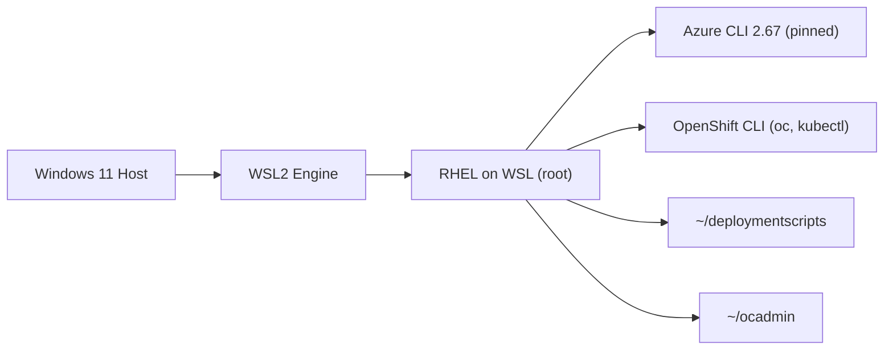
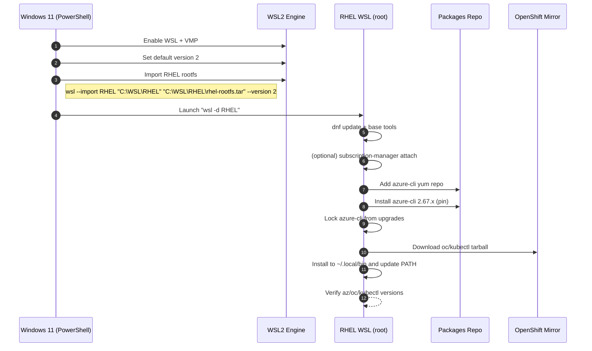

# Local RHEL on WSL2 + Azure CLI 2.67 + OpenShift CLI (oc/kubectl) — Step-by-Step

> [!IMPORTANT]  
> Depending on your companies security policies shared key access may be prohibited, which is the default deployment process for ARO clusters. Currently in preview is the ability to deploy ARO clusters with managed identities.
> 
> The steps to deploy the ARO management node ensures that scripts for both shared key access and managed identities will deploy.
> 
> Managed Identities use a preview of aro extension that is only supported with az cli version 2.67, current Cloud Shell version in the Azure Portal, VS Code and WSL2 is 2.77, thus the steps below pin the cli version to 2.67 to ensure compatibility. 

---

## What you’ll build



> [!TIP]  
> Work in **Windows Terminal** (PowerShell) for host tasks and the **RHEL WSL shell** for Linux tasks. Keep both panes open.

---

## Section 1 — Install a **RHEL image on WSL2** (Windows 11)

### 1. Enable required Windows features (PowerShell as Administrator)
```powershell
dism.exe /online /enable-feature /featurename:Microsoft-Windows-Subsystem-Linux /all /norestart
dism.exe /online /enable-feature /featurename:VirtualMachinePlatform /all /norestart
wsl --set-default-version 2
```

> [!CAUTION]  
> If virtualization is disabled in firmware, enable **Intel VT-x/AMD-V** in BIOS/UEFI before continuing.

### 2. Prepare a working folder and RHEL rootfs archive
- Create a folder for your distro (on a fast SSD path, e.g., `C:\WSL\RHEL`).
- Obtain a RHEL rootfs tarball (from your RHEL subscription or your approved internal mirror). Name it `rhel-rootfs.tar`.

```powershell
New-Item -ItemType Directory -Path C:\WSL\RHEL | Out-Null
# Place rhel-rootfs.tar into C:\WSL\RHEL
```

> [!TIP]  
> You can also export from an existing RHEL WSL to make a gold image:  
> `wsl --export <ExistingRHEL> C:\WSL\RHEL\rhel-rootfs.tar`

### 3. Import the RHEL distro into WSL
```powershell
wsl --import RHEL C:\WSL\RHEL C:\WSL\RHEL\rhel-rootfs.tar --version 2
wsl -d RHEL
```

### 4. Inside RHEL (first boot) — baseline setup (as `root`)
```bash
# Make sure we're root (RHEL images often start as root)
whoami

# Update base, set timezone/locale as needed
dnf -y update
dnf -y install vim curl tar gzip ca-certificates shadow-utils

# (Optional) Create a non-root admin user
useradd -m -s /bin/bash joel
echo 'joel ALL=(ALL) NOPASSWD: ALL' > /etc/sudoers.d/99-joel
passwd -d joel  # or set a password if preferred
```

> [!TIP]  
> To set default user for this WSL distro from Windows:  
> `C:\WSL\RHEL\RHEL.exe config --default-user joel`  
> (If the launcher isn’t present, you’ll stay as `root` by default — fine for lab use.)

### 5. (If applicable) Register RHEL and enable repos
```bash
# If you have a valid subscription:
subscription-manager register --username YOUR_RH_USER --password '***'
subscription-manager attach --auto
subscription-manager refresh
dnf repolist
```

---

## Section 2 — Install **Azure CLI 2.67** (pinned) in RHEL on WSL

> [!IMPORTANT]  
> We’ll pin **2.67** specifically (required for certain ARO preview flows), then lock the package to avoid unintended upgrades.

### Option A — Install from Microsoft Yum repo and pin exact version
> Works on RHEL-compatible environments where the repo provides historical versions.

1) Add the Microsoft Azure CLI repo:
```bash
cat >/etc/yum.repos.d/azure-cli.repo <<'EOF'
[azure-cli]
name=Azure CLI
baseurl=https://packages.microsoft.com/yumrepos/azure-cli
enabled=1
gpgcheck=1
gpgkey=https://packages.microsoft.com/keys/microsoft.asc
EOF
dnf -y clean all
dnf -y makecache
```

2) Discover available versions and install **2.67.x**:
```bash
dnf list --showduplicates azure-cli | grep 2\.67 || true
# Example install (adjust the exact build suffix for your platform, e.g., el9 or el8)
dnf -y install azure-cli-2.67.0-1.el9
```

3) Prevent auto-upgrade:
```bash
sudo bash -c 'echo -e "[main]\nexclude=azure-cli*" >> /etc/dnf/dnf.conf'
az version
```

### Option B — Pipx fallback (when yum repo lacks 2.67 for your RHEL build)
> Installs into an isolated environment; handy for WSL lab images.

```bash
# Prereqs
dnf -y install python3 python3-pip
python3 -m pip install --user pipx
python3 -m pipx ensurepath
# Re-enter shell to get PATH or source ~/.bashrc
pipx install "azure-cli==2.67.0"
az version
```

> [!CAUTION]  
> If both a repo version and a pipx version exist on PATH, `which az` first. Prefer **one** method to avoid confusion.

### (Optional) Add the ARO extension (preview)
```bash
az extension add --name aro --upgrade
az extension list
```

---

## Section 3 — Prepare working folders in `/root`

Create two folders for your workflows: `~/deploymentscripts` and `~/ocadmin`.

```bash
# As root inside RHEL WSL
mkdir -p ~/deploymentscripts ~/ocadmin
ls -ld ~/deploymentscripts ~/ocadmin
```

---

## Section 4 — Install **OpenShift CLI** (oc) + **kubectl**

### Option A — Latest stable (script provided)
```bash
sudo dnf -y install curl tar gzip
mkdir -p ~/.local/bin
TMPDIR="$(mktemp -d)"
curl -L -o "$TMPDIR/openshift-client-linux.tar.gz"   https://mirror.openshift.com/pub/openshift-v4/x86_64/clients/ocp/stable/openshift-client-linux.tar.gz
tar -xzf "$TMPDIR/openshift-client-linux.tar.gz" -C ~/.local/bin oc kubectl
grep -q 'export PATH=$HOME/.local/bin:$PATH' ~/.bashrc || echo 'export PATH=$HOME/.local/bin:$PATH' >> ~/.bashrc
source ~/.bashrc
oc version --client
kubectl version --client
```

> [!TIP]  
> On **ARM64**, change `x86_64` to `arm64` in the URL.

### Option B — Pin a specific oc version (example)
```bash
OC_VER="4.16.19"
ARCH="x86_64"  # or arm64
URL="https://mirror.openshift.com/pub/openshift-v4/${ARCH}/clients/ocp/${OC_VER}/openshift-client-linux-${OC_VER}.tar.gz"

sudo dnf -y install curl tar gzip
mkdir -p ~/.local/bin
TMPDIR="$(mktemp -d)"
curl -L -o "$TMPDIR/oc.tgz" "$URL"
tar -xzf "$TMPDIR/oc.tgz" -C ~/.local/bin oc kubectl
grep -q 'export PATH=$HOME/.local/bin:$PATH' ~/.bashrc || echo 'export PATH=$HOME/.local/bin:$PATH' >> ~/.bashrc
source ~/.bashrc
oc version --client
```

---

## End-to-End Sequence (what happens, in order)



---

## Verify & First-Run Checks

```bash
# Azure CLI
az version
az login --use-device-code

# OpenShift CLI (client-only check)
oc version --client
kubectl version --client

# Folder layout
tree -L 1 ~/
```

> [!CAUTION]  
> If `az login` fails on WSL due to browser integration, use `--use-device-code` and follow the prompt in a Windows browser.

---

## Troubleshooting

- **`az: command not found`**  
  Confirm installation path: `command -v az`. If using pipx, ensure `~/.local/bin` is on PATH and re-source `~/.bashrc`.

- **Repo doesn’t offer 2.67**  
  Use **Option B (pipx)** to pin `azure-cli==2.67.0`.

- **`oc` not found**  
  Confirm the tar extracted **`oc` and `kubectl`** into `~/.local/bin`. Check permissions: `chmod +x ~/.local/bin/oc ~/.local/bin/kubectl`.

- **Conflicting az versions**  
  `which az` and `az version` to confirm the active one. Remove one method or adjust PATH order.

---

*End of Guide*
