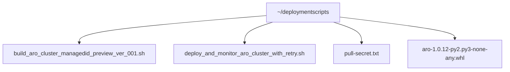
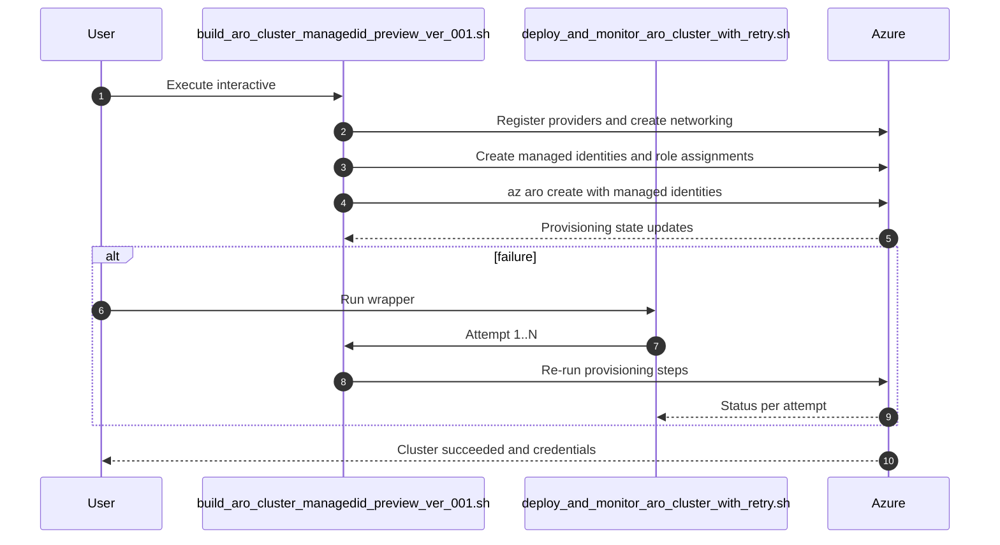
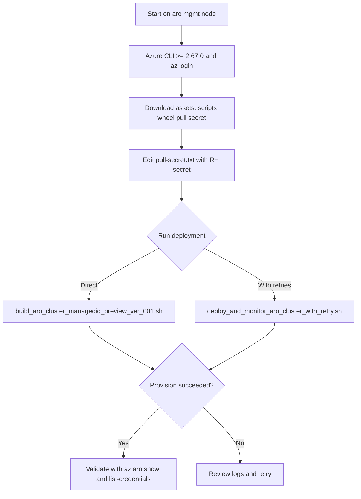

# Module 01 — Deploy ARO Cluster (Managed Identities)

> [!NOTE]   
> Deploy an Azure Red Hat OpenShift (ARO) cluster using **managed identities** using `aro-mgmt-node` from Module-00 with the provided scripts and resources.

---

## 1) Prerequisites

- **Azure CLI** ≥ **2.67.0** (check with `az version`).
- You can sign in to Azure: `az login` (or `az login --use-device-code` in headless scenarios).
- You have permissions to create Resource Groups, Managed Identities, role assignments, networking, and ARO resources (Owner or Contributor + User Access Administrator).

### Quick Checks
```bash
# Must be >= 2.67.0
az version | jq -r '."azure-cli"'
# Login (opens browser unless using device code)
az login
# Ensure subscription is selected (if multiple present)
az account show --output table
```

> **TIP:** If prompted to choose a subscription repeatedly, set a default:
```bash
SUB_ID="$(az account list --query '[0].id' -o tsv)"
az account set --subscription "$SUB_ID"
```

---

## 2) Folder Layout on the aro-mgmt-node

We'll place all assets in `~/deploymentscripts`.



---

## 3) Download the Required Files (script included)

Run the following **download script** to create the folder and fetch all artifacts into it.

```bash
cat > ~/deploymentscripts/download_aro_assets.sh <<'EOF'
#!/usr/bin/env bash
set -euo pipefail

DEST="${HOME}/deploymentscripts"
mkdir -p "${DEST}"
cd "${DEST}"

echo "📥 Downloading ARO deployment assets into ${DEST} ..."

# Scripts (raw URLs)
curl -fsSL -o build_aro_cluster_managedid_preview_ver_001.sh \
  https://raw.githubusercontent.com/heisthesisko/Azure_RedHat_OpenShift_Virtulization/refs/heads/main/scripts/managedID-deploy/build_aro_cluster_managedid_preview_ver_001.sh

curl -fsSL -o deploy_and_monitor_aro_cluster_with_retry.sh \
  https://raw.githubusercontent.com/heisthesisko/Azure_RedHat_OpenShift_Virtulization/refs/heads/main/scripts/managedID-deploy/deploy_and_monitor_aro_cluster_with_retry.sh

curl -fsSL -o pull-secret.txt \
  https://raw.githubusercontent.com/heisthesisko/Azure_RedHat_OpenShift_Virtulization/refs/heads/main/scripts/managedID-deploy/pull-secret.txt

# ARO extension wheel (use RAW URL, not the HTML 'blob' page)
curl -fsSL -o aro-1.0.12-py2.py3-none-any.whl \
  https://raw.githubusercontent.com/heisthesisko/Azure_RedHat_OpenShift_Virtulization/refs/heads/main/scripts/managedID-deploy/aro-1.0.12-py2.py3-none-any.whl

chmod +x build_aro_cluster_managedid_preview_ver_001.sh deploy_and_monitor_aro_cluster_with_retry.sh

echo "✅ All assets downloaded."
echo "➡️  Next: Update pull-secret.txt with your Red Hat pull secret JSON."
EOF

chmod +x ~/deploymentscripts/download_aro_assets.sh
~/deploymentscripts/download_aro_assets.sh
```

> **IMPORTANT:** Open `pull-secret.txt` and replace its contents with your **actual** Red Hat pull secret JSON, then save.

---

## 4) Deploy the ARO Cluster (Managed Identities)

What it does (high level):
- Installs the **ARO preview CLI extension** from the local `.whl` file.
- Registers required **resource providers** (Microsoft.RedHatOpenShift, Network, Compute, Storage, Authorization).
- Creates/uses a **Resource Group**.
- Provisions **VNet**, **master/worker subnets**.
- Creates **managed identities** (cluster + operator identities) and assigns required **roles/scopes**.
- Reads your **pull-secret.txt** and runs `az aro create` with `--enable-managed-identity` and operator workload identities.
- Waits for **provisioningState = Succeeded**.
- The wrapper streams logs to a timestamped file like `aro_deployment_YYYYmmdd_HHMMSS.log` in the working directory.s

## End-to-End Sequence (what happens, in order)

```bash
cd ~/deploymentscripts
./deploy_and_monitor_aro_cluster_with_retry.sh
```
---

### Option without retry wrapper — Direct Deployment

Run the main deployment script (interactive prompts for RG/Cluster name/Region/SKUs):

```bash
cd ~/aro_managedid_deploy
./build_aro_cluster_managedid_preview_ver_001.sh
```

## 5) Validate the Deployment

```bash
# Replace with your values
RG="<YourResourceGroup>"
CLUSTER="<YourClusterName>"

# Show overall status
az aro show -g "$RG" -n "$CLUSTER" -o table

# (Optional) Get OpenShift console creds (kubeadmin)
az aro list-credentials -g "$RG" -n "$CLUSTER" -o table

# (Optional) Get cluster console URL
az aro show -g "$RG" -n "$CLUSTER" --query 'consoleProfile.consoleURL' -o tsv
```

---

## 6) Troubleshooting & Tips

- **Version check fails?** Upgrade Azure CLI to ≥ 2.67.0.
- **Authentication/permissions errors?** Ensure you have sufficient RBAC on subscription and resource group scopes.
- **Pull secret errors?** Ensure `pull-secret.txt` contains valid JSON (no trailing commas; preserve quotes). On Windows-edited files, remove `\r` (CRLF) if necessary.
- **Long waits:** ARO provisioning typically takes 30–45+ minutes; network and region load can affect timing.
- **Retry wrapper:** Use `deploy_and_monitor_aro_cluster_with_retry.sh` to handle transient failures.

## Flowchart — End-to-End


---

## Appendix — Notes

- The **ARO CLI extension** `.whl` is installed locally by the main script prior to `az aro create` to enable managed identity preview flags.
- The scripts are designed to be run from the same directory so the main script can read `./pull-secret.txt`.
- Default VNet address spaces/subnets are created by the script; adjust in-script if your IP plan differs.
