> [!NOTE] 
> The modules in this repository will guide through the following workflow


Flowchart:

1. Logging into OCP console after ARO cluster has been created
2. Update the ocp version channel in via the portal
3. Unblock channel updates to allow upgrade to 4.18 or 4.19 via az command
4. Launch upgrade via the OC portal
5. Create oc admin login scripts to be ease administration in later modules


# Logging into OCP console after ARO cluster has been created

1. Get the ocp console url for the target cluster from the Azure portal ARO Clusters Blade

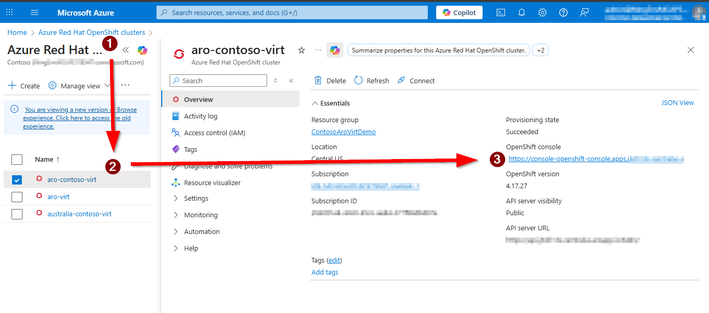

2. Copy the url and paster into your browser and go to the portal login page

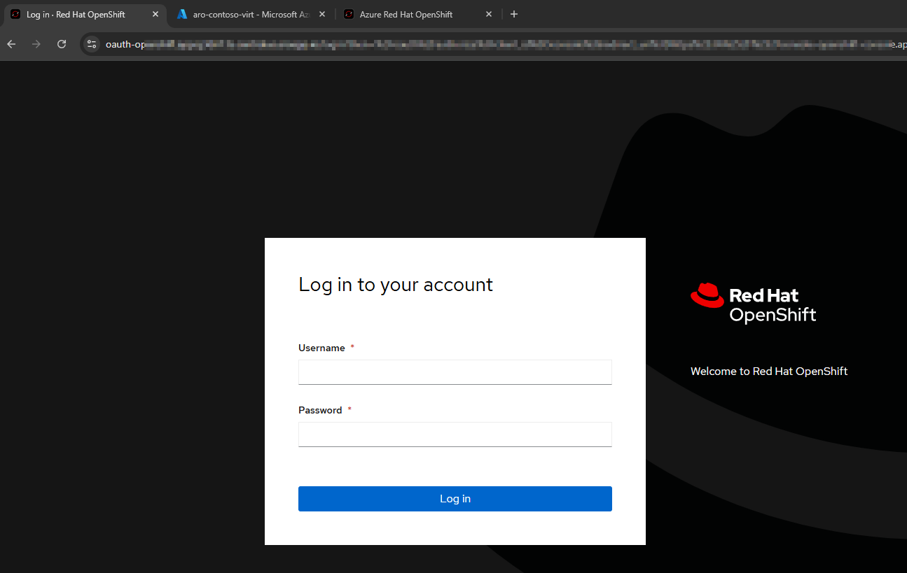

3. Log into the az cli on your Admin Node to obtain your credentials

```bash
az aro list-credentials --name <your_cluster_name> --resource-group <your_resource_group_name>
```
Your output should look like this:

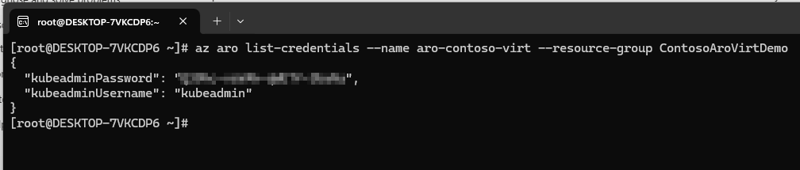

4. Use these credentials to login into the OpenShift Portal

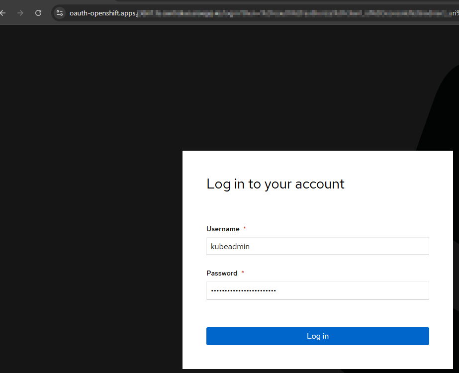

# Update the ocp version channel in via the portal

1. Once logged in you are brought into Overview pane of the Console, in the center of the screen ensure that you have a green check mark indicating a healthy status of the cluster. You may see Insights are disabled which is expected.
2. You will navigate to the Administration tab on the left side of the console to set the ocp channel.

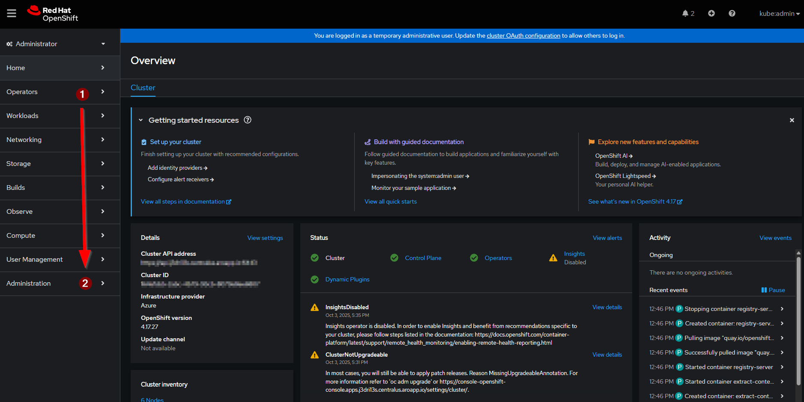

3. Click on Cluster Settings in the Administration section of the Console, you will see in console that the current version is 4.17.27, you will also see an alert that the cluster should not be updated to the next minor version, which we must in order to enable the Virtualization Operator. Following steps will show how to unblock this to proceed to ocp version 4.18. 

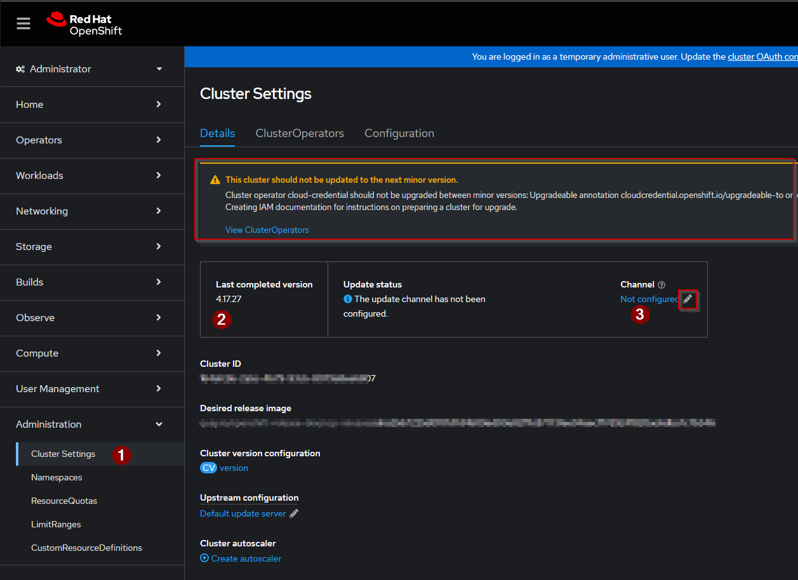

4. Click on the pencil icon to configure our preferred upgrade channel. You will be presented with a pop up form to enter your channel

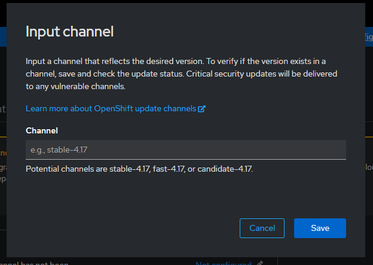

5. We will target by typing in the form stable-4.18 and save.

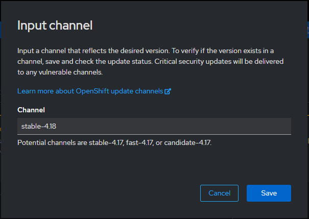

6. You will now see in the console our Channel is set to stable-4.18, however we are blocked from going to 4.18.24

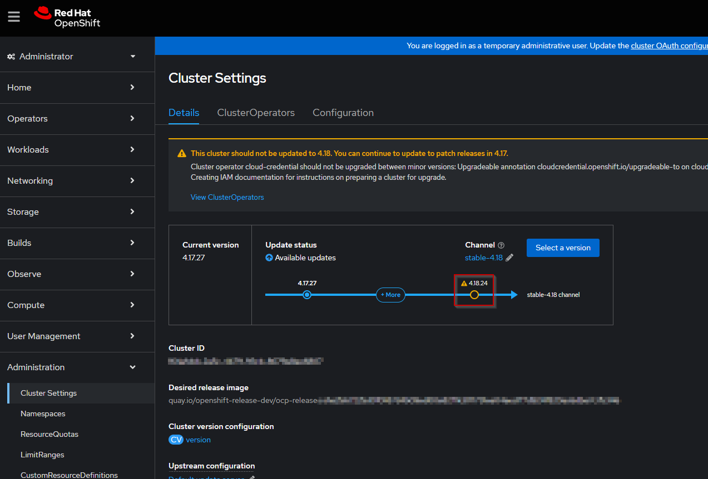

# Unblocking Channel update

1. From your Admin Node run the following command:

```bash
az aro update --name aro-contoso-virt --resource-group ContosoAroVirtDemo --upgradeable-to 4.18.24
```
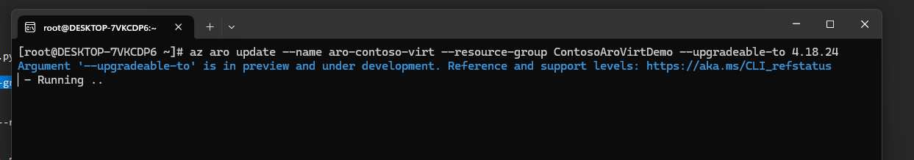

> [!NOTE]
> The command takes a minute or two to execute. Once finished you will see some output in the Admin node console and return to a normal prompt waiting for input.

2. The command will start the upgrade process to unblock the cluster upgrade, typically this will take a few minutes and you will see the portal transition a few times until the cluster is ready to update.

Initial view after command succeeds

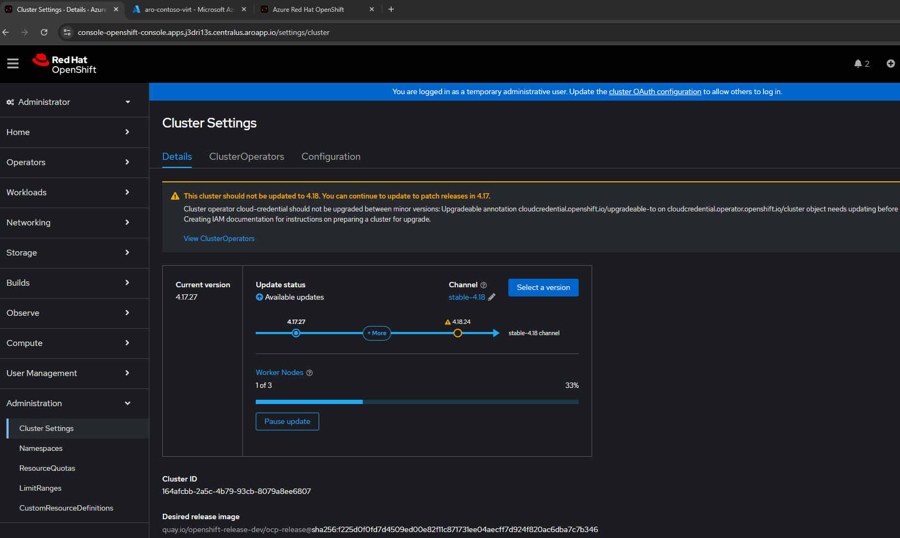

View that Cluster is now ready to update to next version

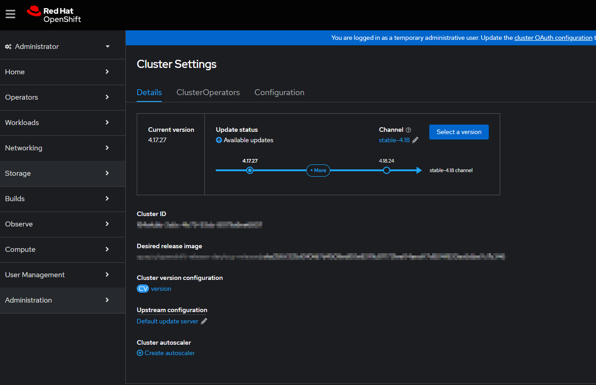

# Launch upgrade via the OC portal

1. While logged into the OpenShift Portal under Administration->Cluster Settings->Details, you can click on Select Version

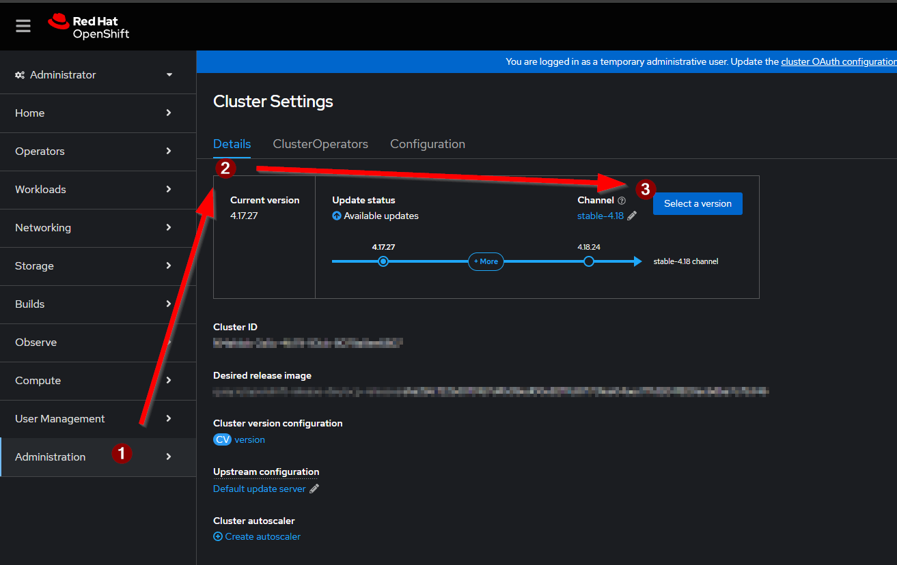

2. We will keep the default value presented, however you can use the drop down to choose another version of 4.18 for your needs. Click on Update to launch the Cluster upgrade

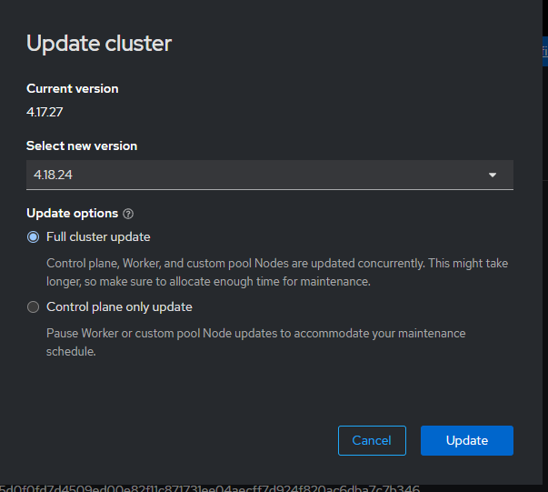

3. The command will take a mitute or two to initiate, once started you will see at the top of the portal in a yellow bar the Cluster is updating from 4.17.27 to 4.18.24

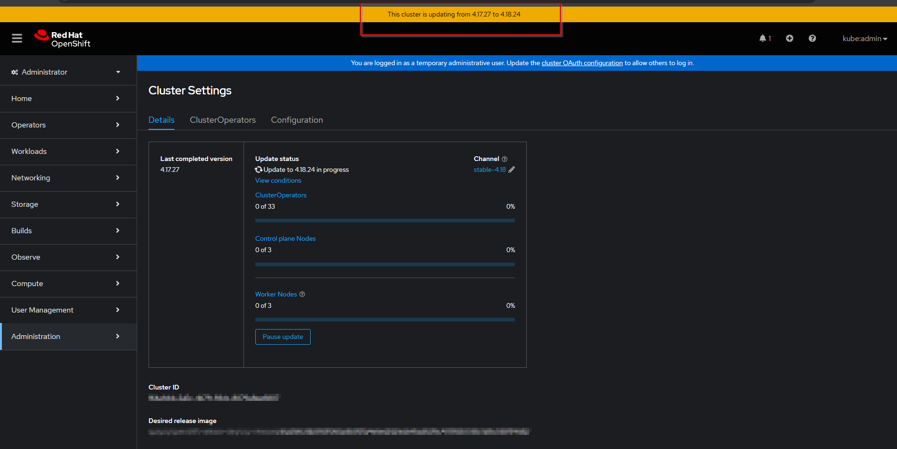

4. The cluster upgrade time varies depending on number of nodes in the cluster and other variables, typically the six node cluster will tale about 45 minutes to fully update.

View from Administration blade the progress of the upgrade

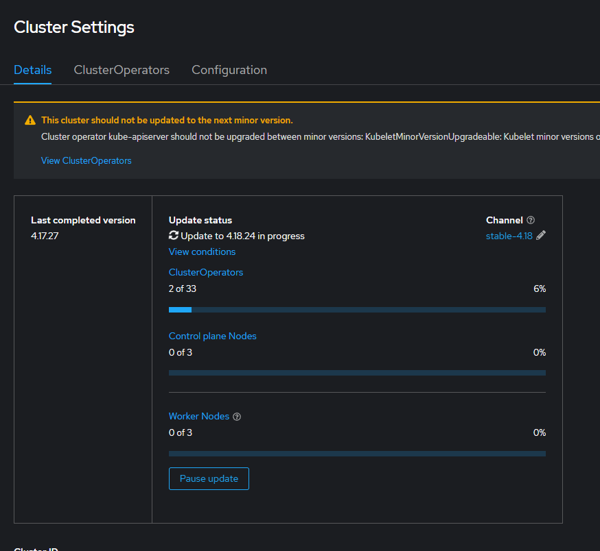

View from the Home Overview blade of the upgrade progress

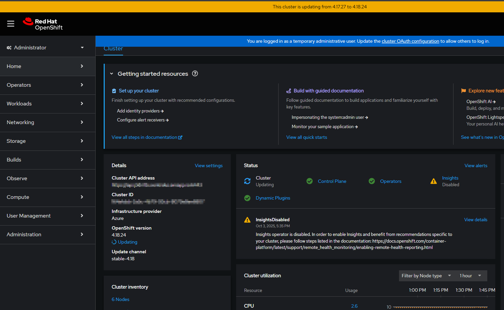

> [!Note] it is not uncommon to see status warnings such as the control plane being degraded, this is normal as the cluster is updated. Eventually the alert will clear and status will return to healthy.
> 
> 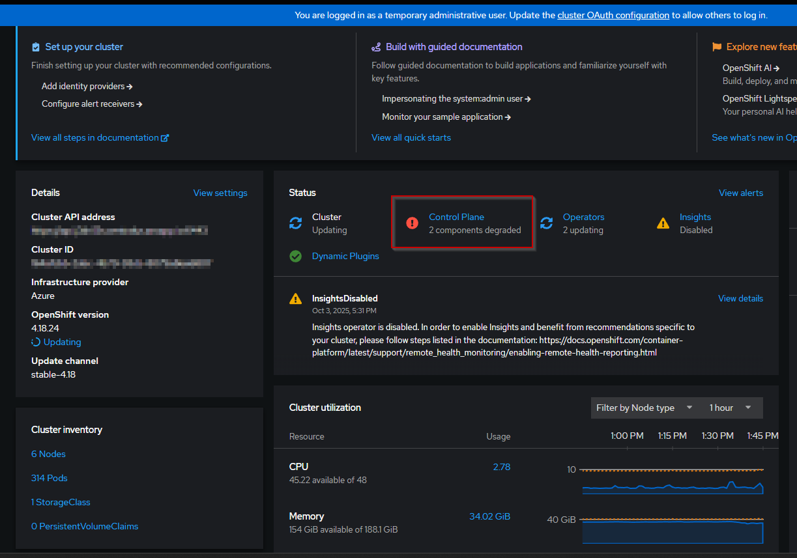


