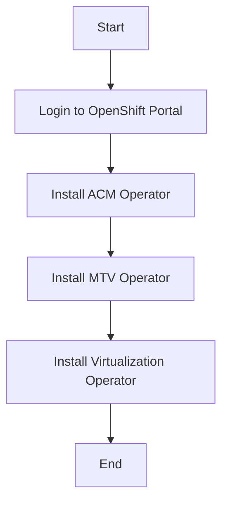

# Module workflow

```mermaid
flowchart TD
  A[Start] --> B[Login to OpenShift Portal]
  B --> C[Install ACM Operator]
  C --> D[Install MTV Operator]
  D --> E[Install Virtualization Operator]
  E --> F[End]
```

> [!NOTE] 
> The steps in this module assume that your OpenShift cluster version is at 4.18.24 or greater.