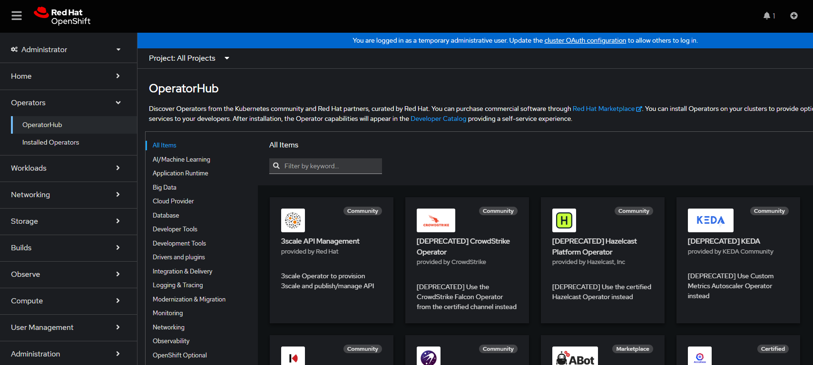
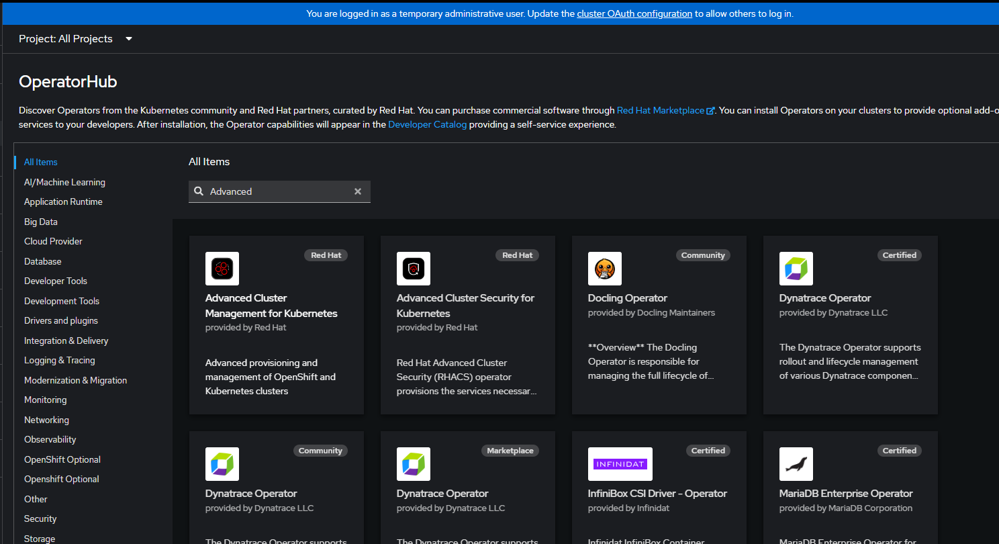
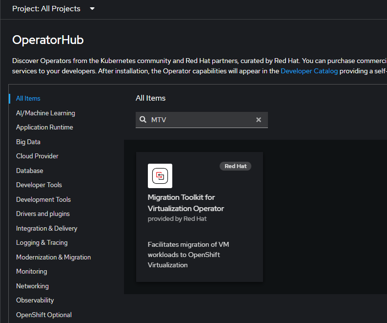

# Module workflow

> [!NOTE] 
> The steps in this module assume that your OpenShift cluster version is at 4.18.24 or greater.

## Installing OpenShift Operators

1. Login into the OpenShift Portal and go to Operators->Operator Hub

2. In the search control, type Advanced, you will see the option for Advanced Cluster Management for Kubernetes, click on the tile to launch the pop-up window

3. Choose your Channel and Version values (defaults to latest) Click Install

4. Select or change values for your installation, in our case we will leave everything at the deafult settings and values. Click Install at the bottom

The install process will start and follow any additional workflow requests if needed. Once finished you will see the Operator was installed.

## Installing Migration Toolkit for Virtualization operator

1. Go to Operators->Operator Hub. In the search control, type MTV, you will see the option for Migration Toolkit for Virtualization Operator, click on the tile to launch the pop-up window

2. Select or change values for your installation, in our case we will leave everything at the deafult settings and values. Click Install at the top

3. FIll out the workflow form, in our case leaving the default values, click install at the top

During the workflow you will be required to Create a ForkLift Controller, click to proceed.

Leave the default values for our needs and click create

Forklift Controller created:

Once you create the first fork-lift controller you can navigate to the Details tab and see the Operator was installed:

## Installing Virtualization Operator

