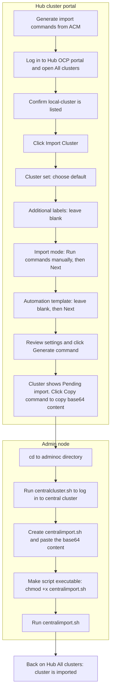
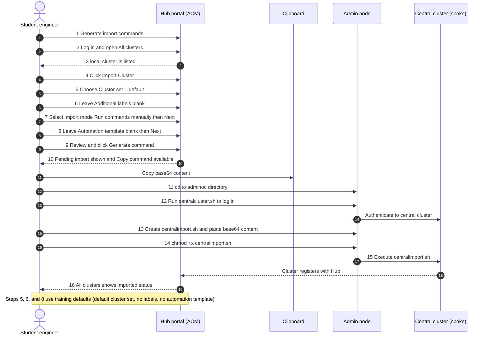

> [!NOTE] 
> The modules in this repository will guide through the following workflow
> [!TIP]
> Ensure that you completed the post deployment actions for oc login to ease the effort to importing the cluster into ACM

Flowchart:

1. Generate import commands from ACM operator on Hub cluster to import spoke clusters
2. Log into the hub cluster OCP portal, go to all clusters
3. Under Cluster list, if no other clusters have imported you should see local-cluster, which is the cluster that has the ACM operator installed
4. To the right of the Search box, you should see a Import Cluster control, click the button to launch the Import form
5. For training purposes you can choose default for Cluster set
6. Leave Additional labels blank for training purposes
7. For import mode we will choose "Run import commands manually", click next
8. Leave Automation template blank for training purposes, click next
9. Review settings, if all looks as expected, click Generate command.
10. On the portal you should see the cluster is pending import, Click the Copy the command button. This will paste the Base 64 content to your local clipboard we will use to generate the OC commands to import the cluster.
11. On the Admin Node, cd directories to the adminoc directory
12. Run the centralcluster.sh to log into the central cluster
13. Once logged into the central cluster, using vi, create a newfile called centralimport.sh, copy the base 64 content from the Copy command from previous step
14. Ensure bash file is executable using chmod +x
15. Run the centralimport.sh file
16. Back in the Hub cluster under All clusters, you should now see that your cluster has been imported.

