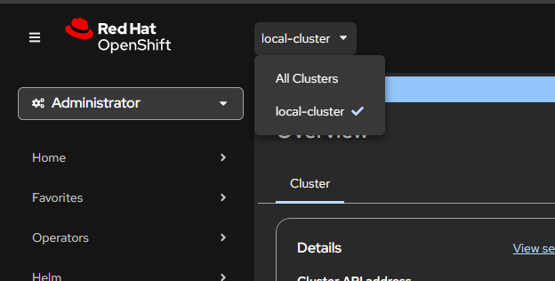
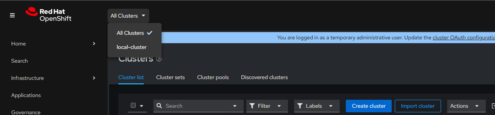
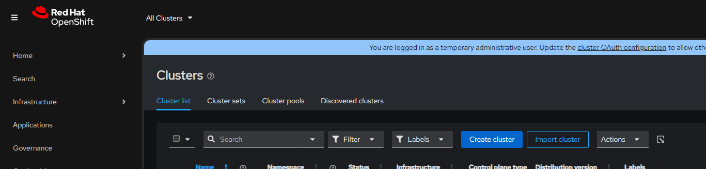
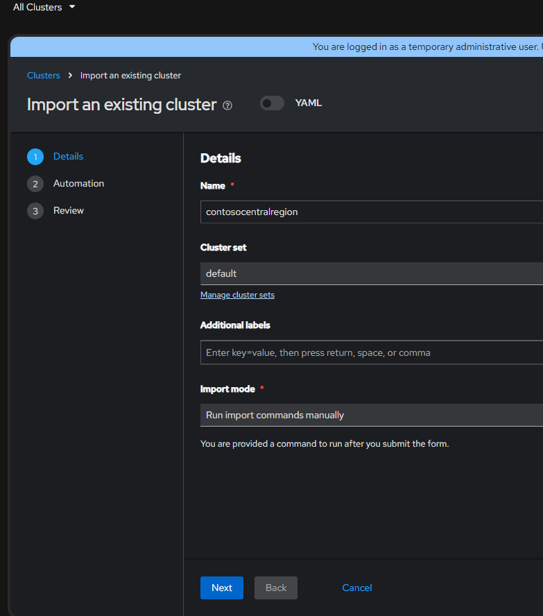
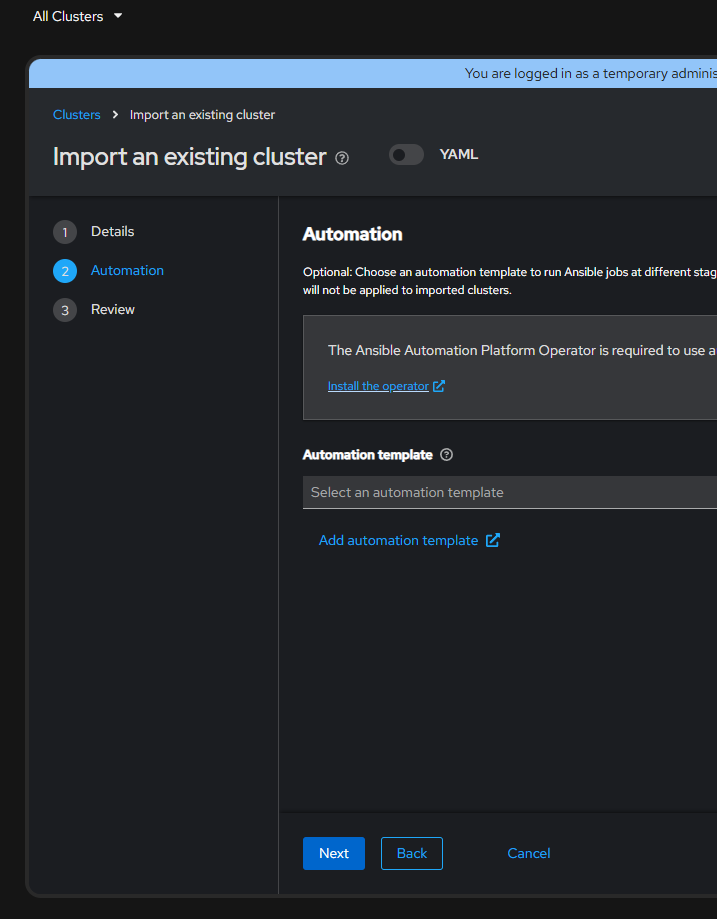
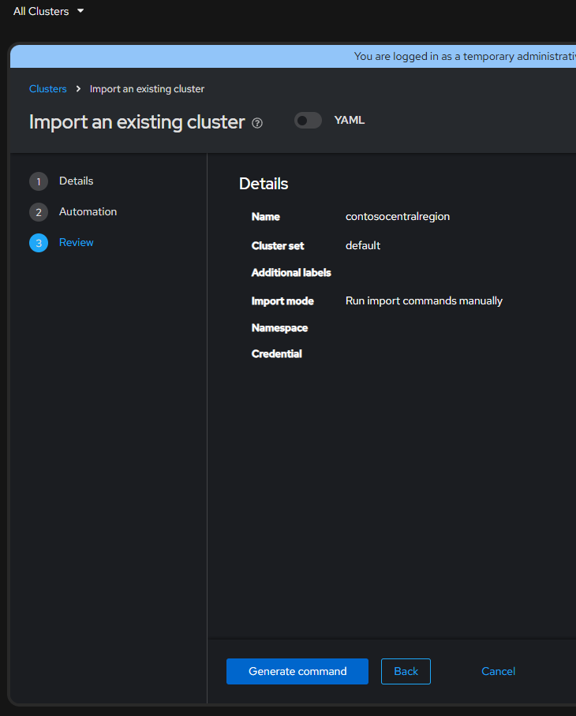
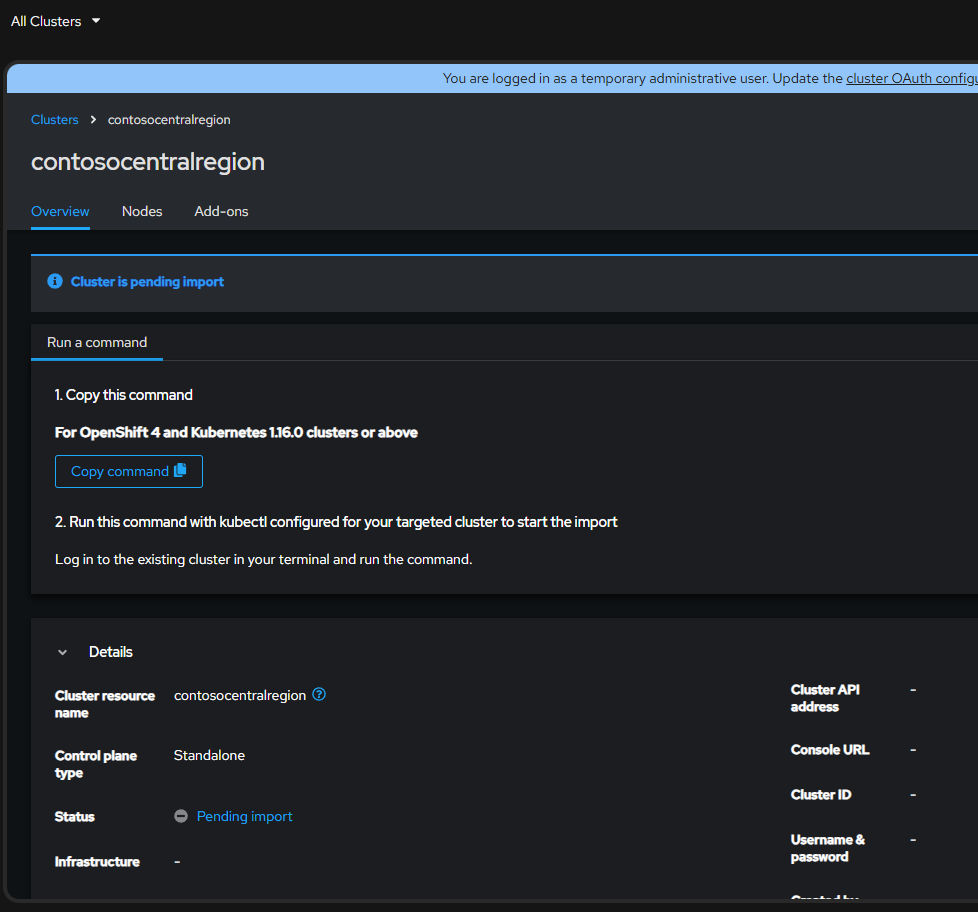

> [!NOTE] 
> The modules in this repository will guide through the following workflow

> [!TIP]
> Ensure that you completed the post deployment actions for oc login to ease the effort to importing the cluster into ACM

# Steps to import OpenShift cluster into ACM

## Step 1 Log into the hub cluster OCP portal, go to all clusters

> [!NOTE] 
> Under Cluster list, if no other clusters have imported you should see local-cluster, which is the cluster that has the ACM operator installed

## Step 2 To the right of the Search box, you should see a Import Cluster control, click the button to launch the Import form

## Step 3 Details form page. Enter the name you will refence the cluster to be imported by, in our case **contosocentralregion**. For training purposes you can choose **default** for Cluster set, Leave Additional Labels blank, and **Run import commands manually**, click next

## Step 4 Automation form page Leave Automation template blank for training purposes, click next

## Step 5 Review settings, if all looks as expected, click Generate command

## Step 6 On the portal you should see the cluster is pending import, Click the Copy the command button. This will paste the Base 64 content to your local clipboard we will use to generate the OC commands to import the cluster.

## Step 9 On the Admin Node, cd directories to the adminoc directory
## Step 10 Run the centralcluster.sh to log into the central cluster
## Step 11 Once logged into the central cluster, using vi, create a newfile called centralimport.sh, copy the base 64 content from the Copy command from previous step
## Step 12 Ensure bash file is executable using chmod +x
## Step 13 Run the centralimport.sh file
## Step 14 Back in the Hub cluster under All clusters, you should now see that your cluster has been imported.