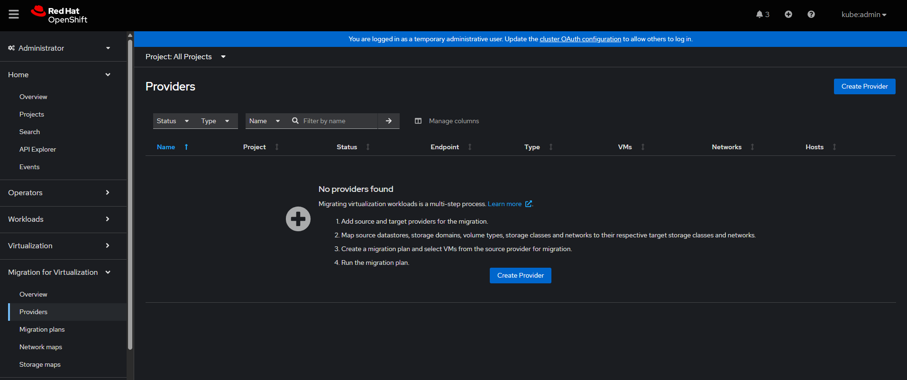
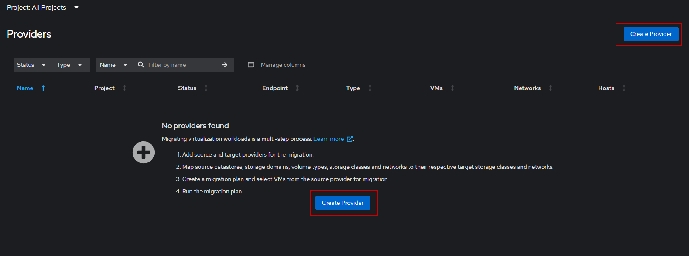
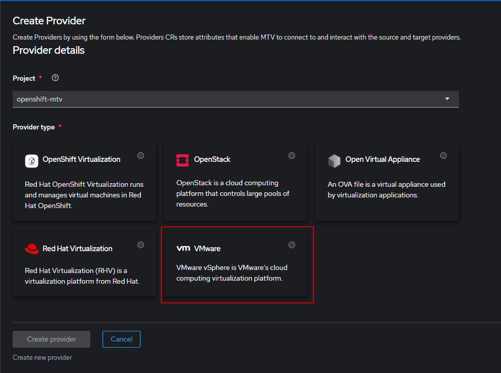
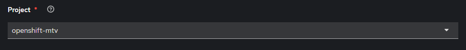
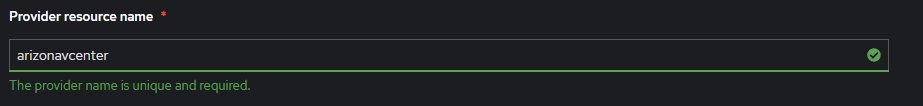
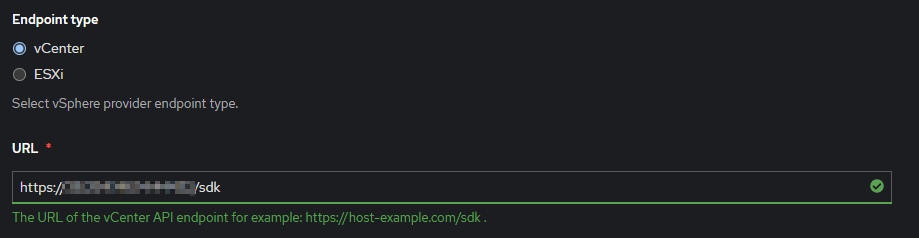
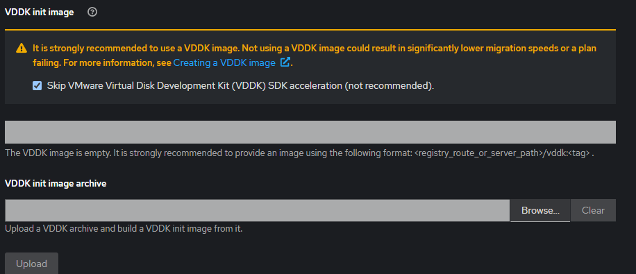
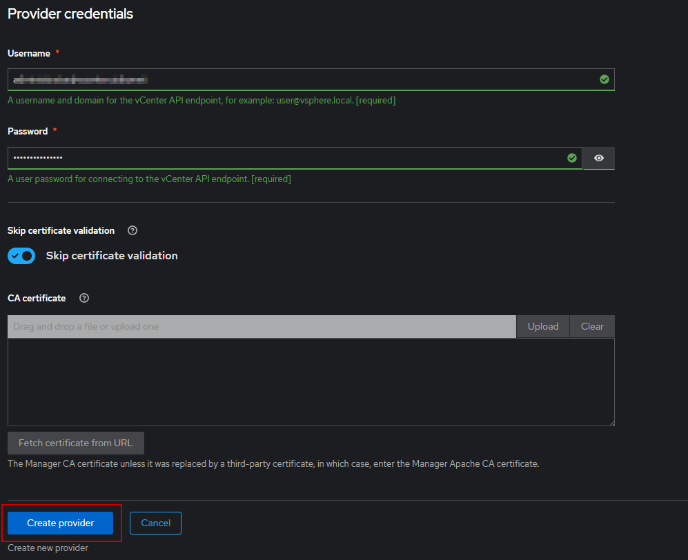
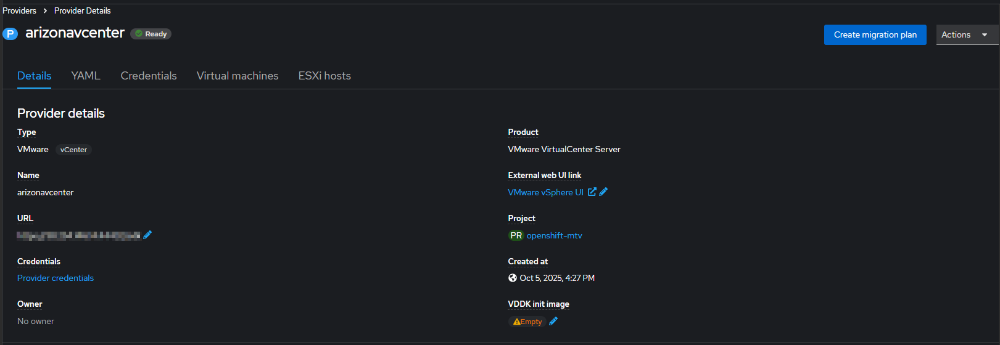
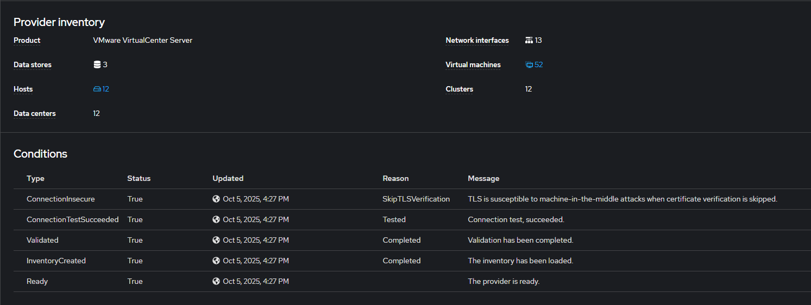

# Integrate VMware with OpenShift clusters to enable for migration

> [!NOTE]
> It is assumed that you have already deployed the Virtualization and Migration Toolkit for Virtualization on your target OCP cluster

## Log into the your OCP cluster that you want to integrate with a VMware deployment

1. Go to the Migration for Virtualization on the left hand side of the OCP console and navigate to Providers

Since this is a new installation we need to create a Provider, click on the Create Provider

You are presented with several Provider types that are supported, in our case we will choose VMware

You are presented with a workflow to fill out, we will leave the default value for project as **openshift-mtv**

For Provider Resource Name we will list it as our **arizonvcenter**

We will choose vCEnter as our endpoint type. The url will be that of the vCenter SDK API.

For lab testing, we will skip installing a VDDK image. 

Add your username and password to enable to authenticate with vcenter. For lab testing we will skip certificate validation. Click Create Provider

You will see the provider will be created very quickly and the inventory of the vCenter will be listed:

