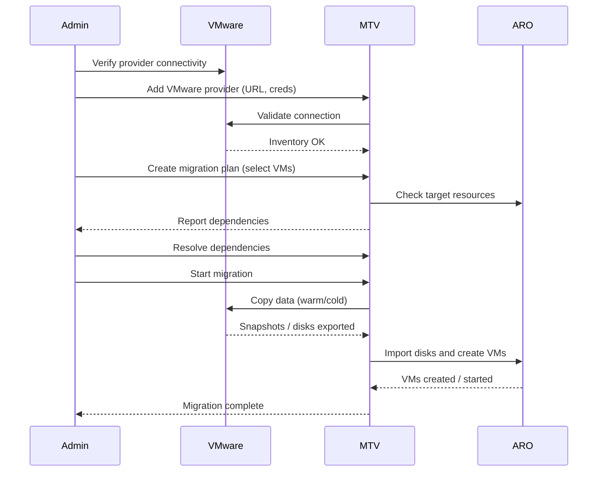

# Creating Migration plans and moving VM's from VMware to Azure RedHat OpenShift Visualization clusters

```mermaid
sequenceDiagram
  participant Admin
  participant VMware
  participant MTV
  participant ARO

  Admin->>VMware: Verify provider connectivity
  Admin->>MTV: Add VMware provider (URL, creds)
  MTV->>VMware: Validate connection
  VMware-->>MTV: Inventory OK

  Admin->>MTV: Create migration plan (select VMs)
  MTV->>ARO: Check target resources
  MTV-->>Admin: Report dependencies
  Admin->>MTV: Resolve dependencies

  Admin->>MTV: Start migration
  MTV->>VMware: Copy data (warm/cold)
  VMware-->>MTV: Snapshots / disks exported
  MTV->>ARO: Import disks and create VMs
  ARO-->>MTV: VMs created / started
  MTV-->>Admin: Migration complete
```