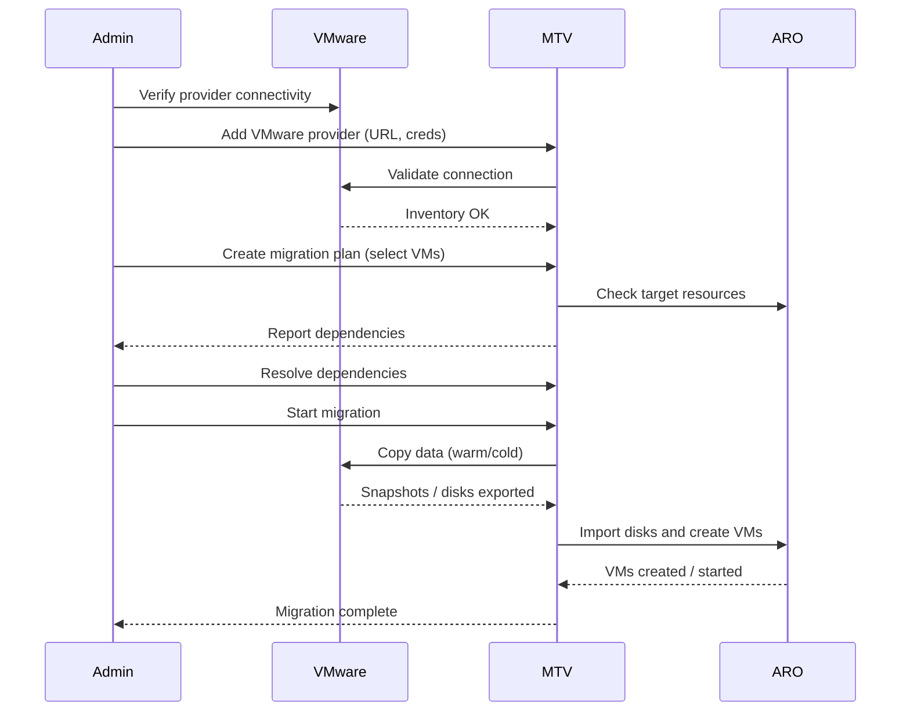

# Creating Migration plans and moving VM's from VMware to Azure RedHat OpenShift Visualization clusters

## Create a Migration plan

1. Log intoOpenShift Console and navigate to Migration for Virtulization -> Migration Plans

2. Create a migration plan by clicking Create Plan control in right corner

3. Fill out the form as in the image, click Next

4. 

1. On the details page, upper right corner click on the Create migration plan control

5. In the plan information fill out the Plan name, in our case **contosovms**, for lab work leave the rest of values as is, blank in some cases. Click Next

