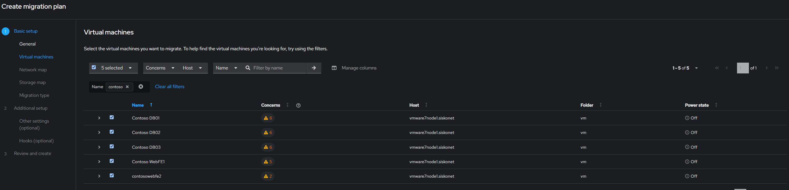
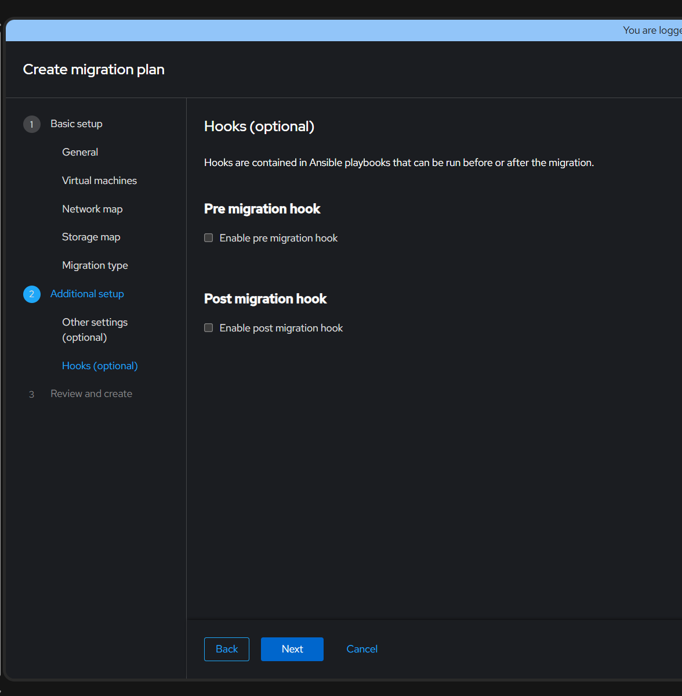

# Creating Migration plans and moving VM's from VMware to Azure RedHat OpenShift Visualization clusters


## Create a Migration plan

1. Log intoOpenShift Console and navigate to Migration for Virtulization -> Migration Plans


2. Create a migration plan by clicking Create Plan control in right corner


3. Fill out the form as in the image, click Next


4. In the Search control, filter by **Contoso**, this will provide a quick way to search the VM inventory to choose from




5. On Network map, choose a new network map for lab purposes, leave values that are prefilled or blank and click Next.


6. On Storage map, choose a new storage map for lab purposes, leave values that are prefilled or blank and click Next.


7. Migration type for lab work, leave as Cold Migration


8. Additional Setup we will not change anything, however notice you can click to preserve static IP's


1. Hooks we will not change anything, however notice you can add a Pre and Post hook to the VM migration, such as:

**Pre-Migration**
```yml
- hosts: vms
  tasks:
    - name: Stop MariaDB
      service:
        name: mariadb
        state: stopped
    - name: Create marker file
      copy:
        dest: /tmp/pre_migration.txt
        content: "Pre-migration complete"
```

**Post-Migration**
```yaml
- hosts: vms
  gather_facts: no
  tasks:
    - name: Download Azure Arc onboarding script
      get_url:
        url: https://aka.ms/AzureArcAgentScript
        dest: /tmp/install_arc_agent.sh
        mode: '0755'

    - name: Run Azure Arc onboarding script
      shell: |
        /tmp/install_arc_agent.sh \
          --resource-group "my-rg" \
          --subscription-id "xxxxxxxx-xxxx-xxxx-xxxx-xxxxxxxxxxxx" \
          --location "eastus" \
          --tenant-id "xxxxxxxx-xxxx-xxxx-xxxx-xxxxxxxxxxxx" \
          --tags "env=prod" \
          --no-proxy
```



9. Review and Create Plan


10. Start Plan


11. Monitor progress by going to the Virtual Machines Tab on the migration plan to see progress


12. Once completed you should see a similar result as below:

