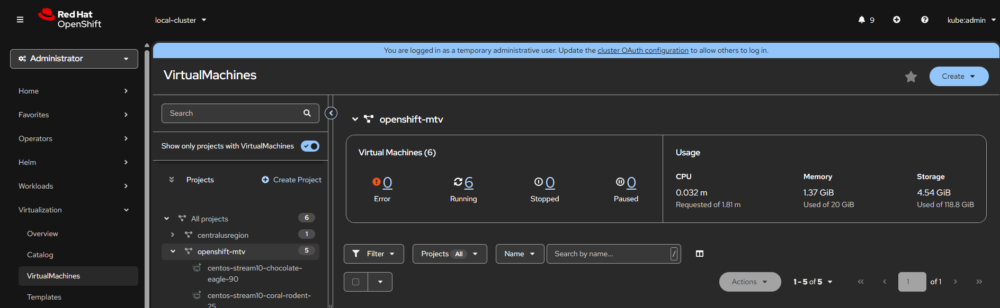
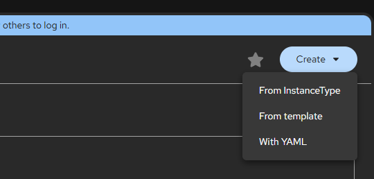
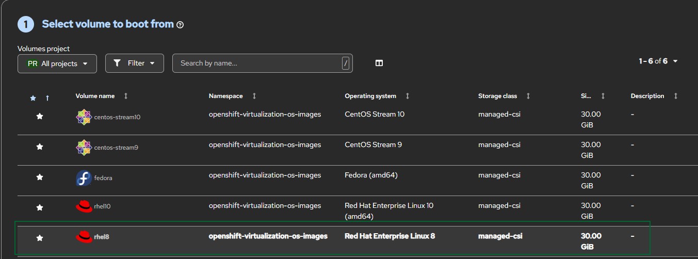
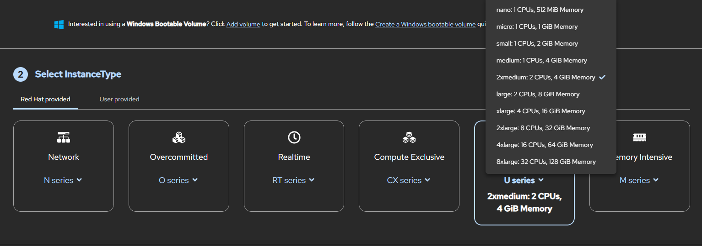
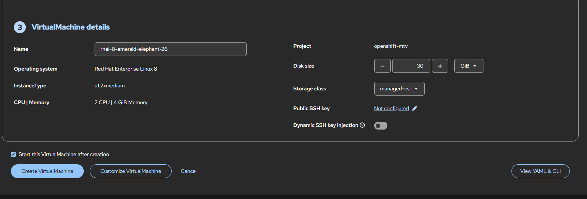
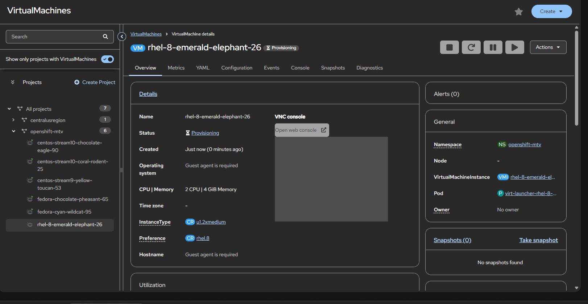
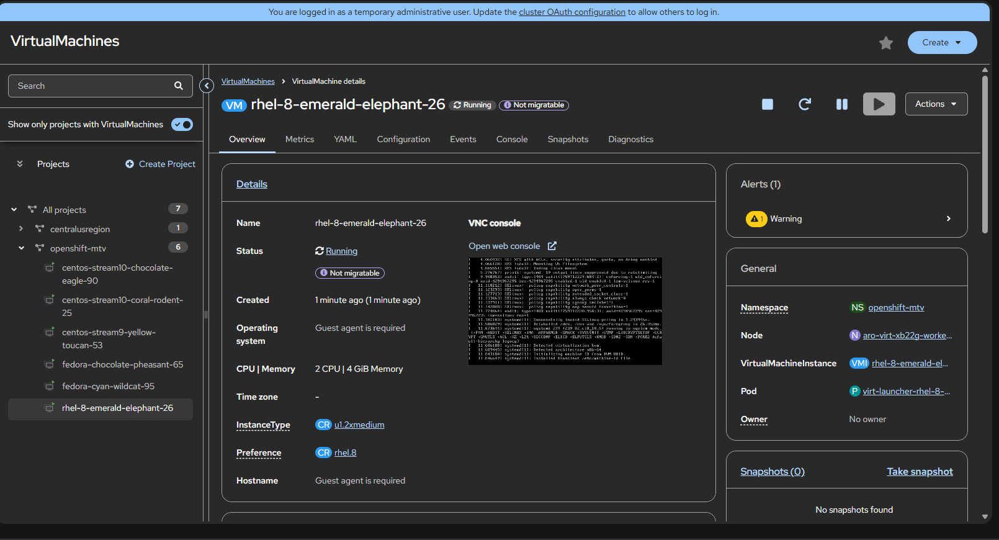
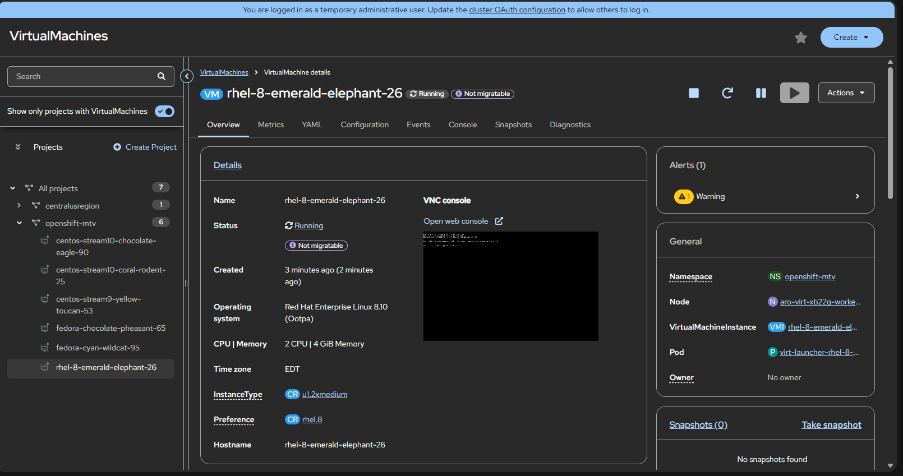

# Creating a new VM on Azure RedHat OpenShift Virtualization in five mouse clicks

## Assuming your logged in your OpenShift Console and on the Virtualization->Virtual Machines blade

Click Number 1 - Create Drop Down Menu

Click Number 2 - From Instance Type

Click Number 3 - Select Volume to Boot from - in our case rhel8

Click number 4 - Select Instance Type

Click number 5 - Click Create Virtual Machine

Monitor VM Provisioning

About 2 minutes later your VM is running:

## Creating a custom VM using your own ISO

