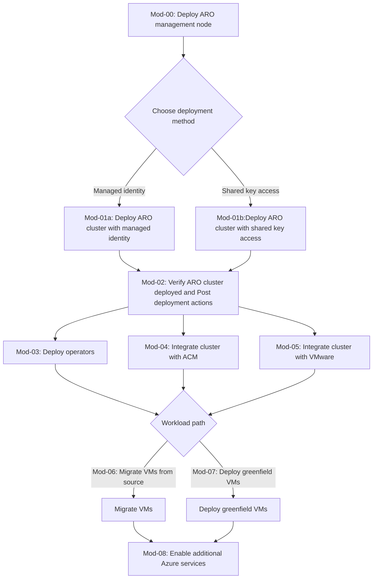

Repository for guides and scripts to deploy ARO Virtualization clusters.

> [!IMPORTANT]  
> As of 10/8/2025 the highest OCP version deployed by Azure Resource Manager in 4.17.27, once deployed you must update the OCP channel to at least 4.18 to support Virtualization
> 
> ARO clusters nodes that will have the Virtualization Operator installed must have a minimum number of 8 cores assigned and use the Standard_DSv5 VM SKU's
> 
> ARO clusters that are upgraded to OCP version 4.19 channel can upgrade to Standard_DSv6 VM SKU's which support nvme drives

> [!NOTE] 
> The modules in this repository will guide through the following workflow

## References

- [ARO Quickstart CLI Guide](https://review.learn.microsoft.com/en-us/azure/openshift/create-cluster?branch=main&pivots=aro-azure-cli)
- [OpenShift Virtualization Guide](https://review.learn.microsoft.com/en-us/azure/openshift/howto-create-openshift-virtualization?branch=main)
- [Migration Toolkit for Virtualization (MTV)](https://docs.redhat.com/en/documentation/migration_toolkit_for_virtualization/2.8)

